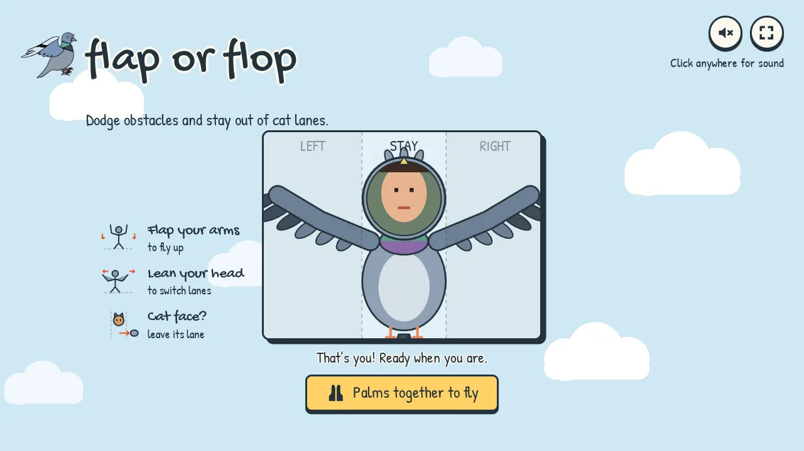
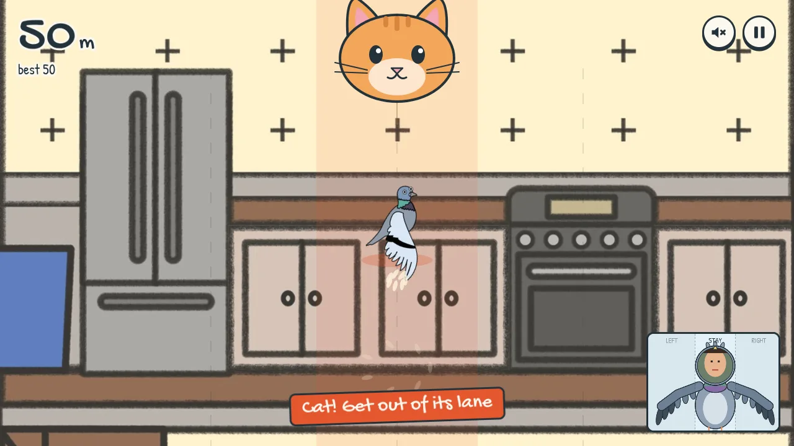

# UI and artwork

Flap or Flop keeps to a few flat colours, thick ink outlines, and handwritten type. The layout follows simple arcade games such as Doodle Jump and Temple Run: one title screen, a score in the corner, a pause button, and nothing else on screen during play. The tagline is "Be a flapper, not a flop."

We avoid the usual signs of generated UI: no gradients, glass, grain, or blur; no emoji, stars, badges, or icon-card rows; no stock icon set (the few icons are drawn for this game in `src/ui/icons.ts`); no fade-on-hover or fade-in effects (buttons press down; the world banner slides); and no em dashes in the copy.





## Layout

The UI layer has the same 16:9 box as the Phaser canvas and is sized in container units (`cqh`). It scales with the game like part of the game frame. The browser window never scrolls, and a plain dark frame fills the letterbox.

| Screen | Contents |
| --- | --- |
| Title | Logo and tagline centred above the mirror on a flat sky with drifting clouds and two faint pigeons, the camera "mirror" in the centre, four doodled rules (left) and the best score (right), both level with the middle of the mirror, sound and fullscreen buttons |
| Flight | Score and best (top left), sound and pause (top right), the player's bird (bottom right), world banner on each map change, a red pill only while a cat threatens |
| Lost tracking | A card with the camera mirror and a Recalibrate button |
| Pause | "paused", palms-together hint, Resume, Quit |
| Game over | Reason, score, best or a "new best!" stamp, Play again, Menu |

## The camera mirror

`src/input/cv/birdAvatar.ts` draws the player as a pigeon. Shoulders and hips set the body, and the shoulder → elbow → wrist chain forms each wing's leading edge, with feathers hanging behind it. Arms that drop out of view fold against the body. The webcam image is drawn only inside a circle around the face, so the player's own face is the bird's head. The rest of the video is never shown. The same avatar appears large while calibrating and small in the corner during play.

## Controls

The camera is the only controller, and it opens when the page loads. Small paired arm flaps rise. Head position in the LEFT / STAY / RIGHT zones changes lane. Palms together starts, resumes, and plays again. There are no keyboard controls or hidden dev keys. On-screen buttons accept mouse clicks as a fallback. `?debug` shows the pose skeleton and timing over the mirror. `?nocamera` is used only by the automated checks.

## The cat

The cat is drawn once at load on a canvas (`src/game/rendering/enemies.ts`), so its edges stay smooth. During the 2.5 second warning a ginger cat peeks down from the top of its lane, the lane takes on a light red tint, and a shadow grows where the paw will land. Then a striped foreleg with pink toe beans slams down the lane and pulls back. Every position comes from the encounter's age, so pausing freezes it in place.

## Rendering boundaries

| Module | Owns |
| --- | --- |
| `src/ui/views.ts` | Screen structure and copy |
| `src/ui/gameUi.ts` | Button actions, camera status, world banner, and HUD updates |
| `src/style.css` | Palette, layout, type, responsive rules, and decorative motion |
| `src/game/scenes` | Game lifecycle and simulation |
| `src/game/rendering` | Scrolling maps, pigeon frames, obstacle images, the cat and paw, the title sky, the Heaven backdrop, and Heaven storm clouds |
| `src/input/cv/birdAvatar.ts` | The pose-driven pigeon with the player's face as its head |
| `src/game/hazardAppearance.ts` | Obstacle variants and matching art dimensions |

UI status changes update only when their state changes. The frame loop updates the altitude and the warning pill. Pause and result dialogs make the underlying HUD inert.

## Artwork

`2D Assets` remains the source of truth. Browser copies live in `public/assets/art`. The original map named Dessert depicts a desert with dunes, cacti, and rocks. The code keeps the `dessert` id, and players see "the desert".

Regenerate the web assets with Python and Pillow:

```sh
python3 -m pip install Pillow
python3 scripts/prepare-art.py
```

The script resizes the tall maps to 1024 px wide, trims obstacle transparency, preserves a common pigeon animation canvas, and creates WebP files. It writes atomically and verifies every output. The 24 browser images total approximately 664 KB. No original PNG is overwritten.

Obstacle images and collision dimensions use the same aspect ratio. The collision inset, seeded lane order, one obstacle limit, 2.5 second lead distance, cat grace period, and warning duration remain in place. The map renderer uses two scrolling images to avoid power of two expansion of tall textures.

## Checks

```sh
npm run lint
npm run typecheck
npm test
npm run build
npm run test:browser
npm run test:camera
npm run test:ui
```

The UI checks cover the camera request on load, a blocked camera, ignored key presses, palms-together start, resume and retry, pause and blur, lost tracking, results, five window sizes with no page scroll, and missing artwork recovery. Real camera accuracy still needs the usual playtest on the demo laptop.
