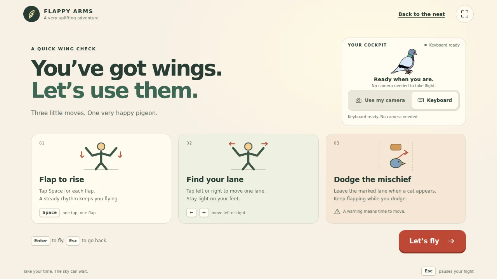

# UI and artwork

Flappy Arms uses the designer’s artwork with a warm paper background, forest green type, coral actions, and short, playful copy. Menus, instructions, the flight HUD, pause, and results share the same visual system.




## Design references

The redesign applies these published usability and accessibility references.

| Reference | Applied to the game |
| --- | --- |
| [Stanford CS147 heuristic evaluation](https://hci.stanford.edu/courses/cs147/2017/au/assignments/simple-heuristic-evaluation.pdf) | Visible input status, consistent actions, recoverable errors, and controls shown before play |
| [Waterloo Digital Accessibility Guide](https://uwaterloo.ca/digital-accessibility/digital-accessibility-guide) | Semantic headings, native buttons, keyboard navigation, text alternatives, and layouts that reflow |
| [Apple game interface guidance](https://developer.apple.com/design/human-interface-guidelines/designing-for-games/) | A quiet HUD, clear primary actions, input choices, and restrained decorative motion |
| [Apple accessibility guidance](https://developer.apple.com/design/human-interface-guidelines/accessibility/) | Visible focus, readable contrast, reduced motion, and 44 px control targets |

## User flow

1. Choose Keyboard or Use my camera. Opening the page does not request camera access.
2. Take flight opens the three movement instructions. Camera mode waits for calibration.
3. Let’s fly starts the existing endless Kitchen, Dessert, and Bird Heaven loop.
4. Esc or Pause freezes flight and encounters. Changing tabs also pauses. Resume with the button, Esc, or a fresh camera confirmation.
5. Fly again restarts a finished run. Back to the nest returns to the menu.

Tracking loss freezes movement and encounters. Its notice offers recalibration and keyboard fallback. Switching input sources discards their old flap and confirmation counts. Gestures behind a pause dialog cannot add lift when play resumes.

Camera instructions match the current motion controls: small paired arm flaps, head position in LEFT / STAY / RIGHT zones, and palms together for menu selection. Returning to STAY rearms the next turn without changing the current lane. The responsive preview preserves the video aspect ratio and aligns the head zones with the mirrored image.

## Rendering boundaries

| Module | Owns |
| --- | --- |
| `src/ui/views.ts` | Screen structure and copy |
| `src/ui/gameUi.ts` | Native UI actions, focus, input status, and HUD updates |
| `src/style.css` | Palette, layout, type, responsive rules, and decorative motion |
| `src/game/scenes` | Game lifecycle and simulation |
| `src/game/rendering` | Scrolling maps, pigeon frames, obstacle images, and procedural cat and Heaven art |
| `src/game/hazardAppearance.ts` | Obstacle variants and matching art dimensions |

UI status changes update only when their state changes. The frame loop updates the altitude, world progress, and hint. Native controls keep their standard Tab, Enter, and Space behavior. Pause and result dialogs contain keyboard focus and make the underlying HUD inert.

## Artwork

`2D Assets` remains the source of truth. Browser copies live in `public/assets/art`. The original map named Dessert depicts a desert with dunes, cacti, and rocks. The existing game level name is retained.

Regenerate the web assets with Python and Pillow:

```sh
python3 -m pip install Pillow
python3 scripts/prepare-art.py
```

The script resizes the tall maps to 1024 px wide, trims obstacle transparency, preserves a common pigeon animation canvas, and creates WebP files. It writes atomically and verifies every output. The 24 browser images total approximately 664 KB. No original PNG is overwritten.

Obstacle images and collision dimensions use the same aspect ratio. The collision inset, seeded lane order, one obstacle limit, 2.5 second lead distance, cat grace period, and warning duration remain in place. The map renderer uses two scrolling images to avoid power of two expansion of tall textures.

## Checks

```sh
npm run lint
npm run typecheck
npm test
npm run build
npm run test:browser
npm run test:camera
npm run test:ui
```

The UI checks cover camera opt in and denial, cancellation, native button activation, pause and retry, focus containment, five viewport sizes, reduced motion, and missing artwork recovery. Real camera accuracy still needs the usual playtest on the demo laptop.
